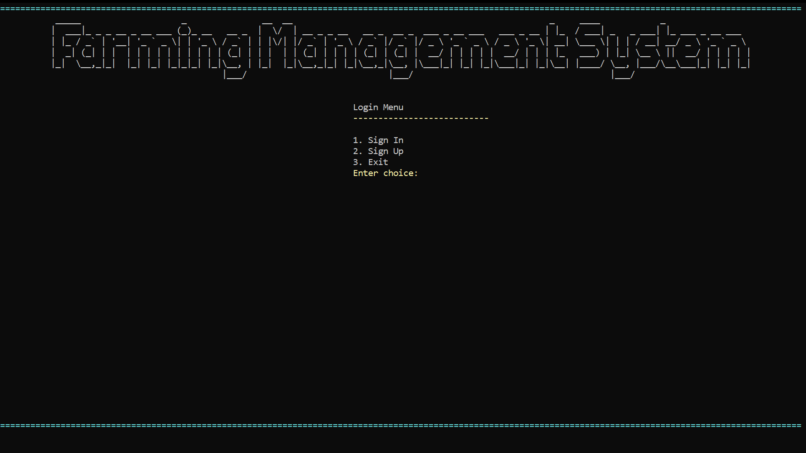
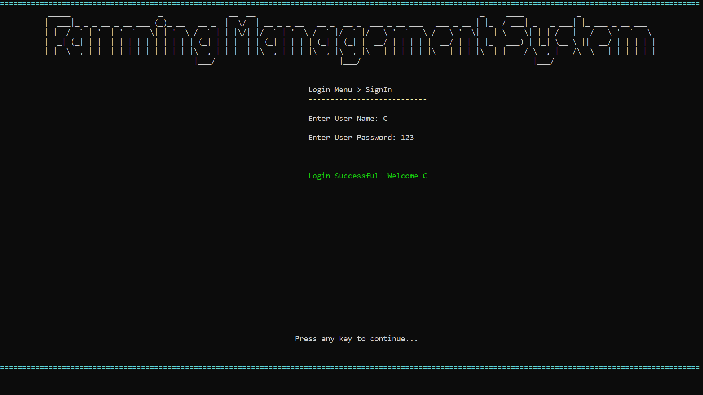
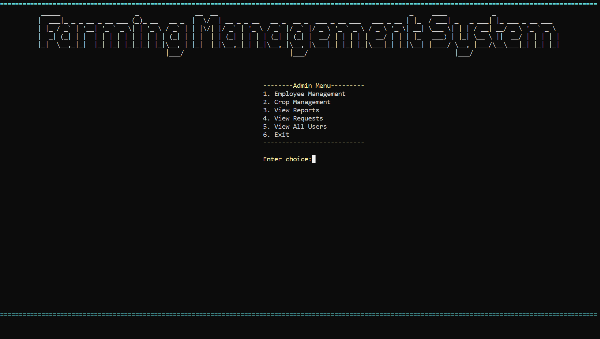
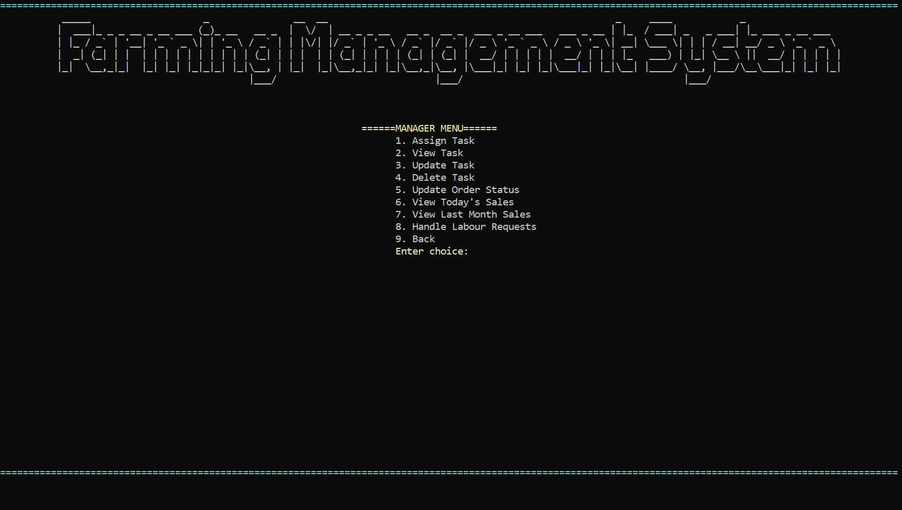
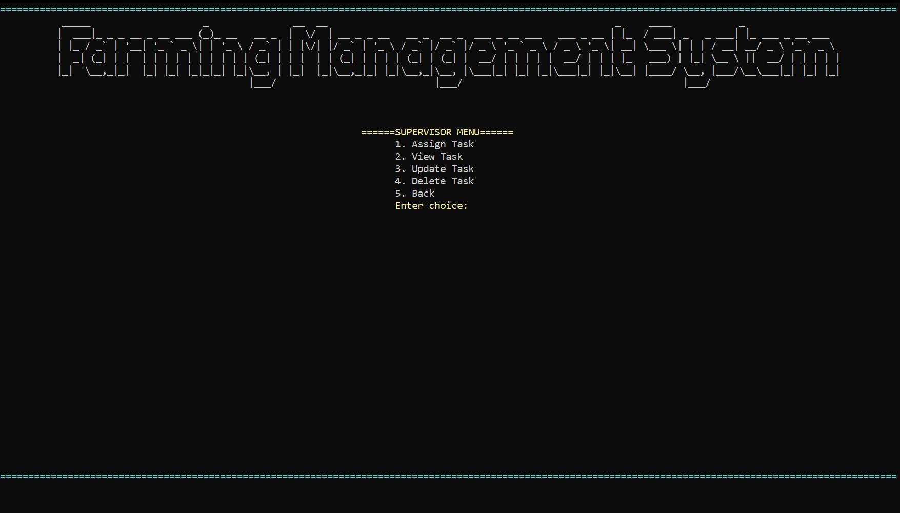

# 🌾 Farming Management System

A **C# (.NET) console-based application** with MySQL database integration that simulates real-world farming operations, including crop management, inventory tracking, expense monitoring, and user management.

Designed with a focus on **clean architecture, OOP principles, and real-world system design**, this project serves as a strong academic and portfolio showcase.

---

## 🚀 Features

### 🌱 Farm Operations

* Crop management (Add / Update / Delete)
* Inventory tracking and stock management
* Expense recording and monitoring

### 👨‍🌾 Employee Management

* Role-based hierarchy:

  * Admin
  * Manager
  * Supervisor
* Structured workforce management

### 🧑‍💼 Customer Module

* Add and manage customer records
* Maintain structured customer data

### 🔐 Authentication System

* Sign Up / Sign In functionality
* Role-based access control
* Input validation for secure login

### 🖥️ Console-Based UI

* Structured and user-friendly navigation
* Cursor-based interface for better interaction

### 🗄️ Database Integration

* MySQL relational database
* Persistent storage with CRUD operations

---

## 🧠 Key Concepts

* Object-Oriented Programming (OOP)
* Role-based system design
* Input validation & error handling
* Modular architecture (Separation of Concerns)
* Database connectivity and CRUD operations

---

## 🛠️ Tech Stack

| Layer     | Technology          |
| --------- | ------------------- |
| Language  | C# (.NET)           |
| Database  | MySQL               |
| Interface | Console Application |
| Tools     | Visual Studio, Git  |

---

## 📂 Project Structure

```bash
Farming-Management-System/
├── src/
│   └── FarmingManagementSystem/
├── database/
│   └── schema.sql
├── docs/
│   └── screenshots/
├── README.md
└── .gitignore
```

---

## 📸 Screenshots

### 🔐 Authentication





### 👨‍🌾 Manager Menu



### 👨‍🌾 Manager Menu



### 👨‍🌾 Supervisor Menu



### 🧑‍💼 Customer Module


### 📦 Inventory Management


---

## ⚙️ Setup

```bash
git clone https://github.com/alisher-devtech/farming-management-system.git
cd farming-management-system
```

1. Import `database/schema.sql` into MySQL
2. Update the database connection string
3. Open solution in Visual Studio
4. Build and run the application

---

## 🚀 Future Improvements

* GUI version (WPF / Windows Forms)
* Web-based system (ASP.NET Core)
* Password hashing & enhanced security
* Reporting and analytics dashboard

---

## 📈 Project Highlights

* Real-world system simulation
* Role-based architecture
* Database-driven design
* Clean and maintainable codebase

---

## 🤝 Contributing

Contributions are welcome:

1. Fork the repository
2. Create a feature branch
3. Submit a pull request

---

## 📧 Contact

**Ali Sher**
📩 Email: [alisher89924@gmail.com](mailto:alisher89924@gmail.com)
💼 GitHub: https://github.com/alisher-devtech

---

## ⭐ Support

If you find this project useful, consider giving it a ⭐ on GitHub.
